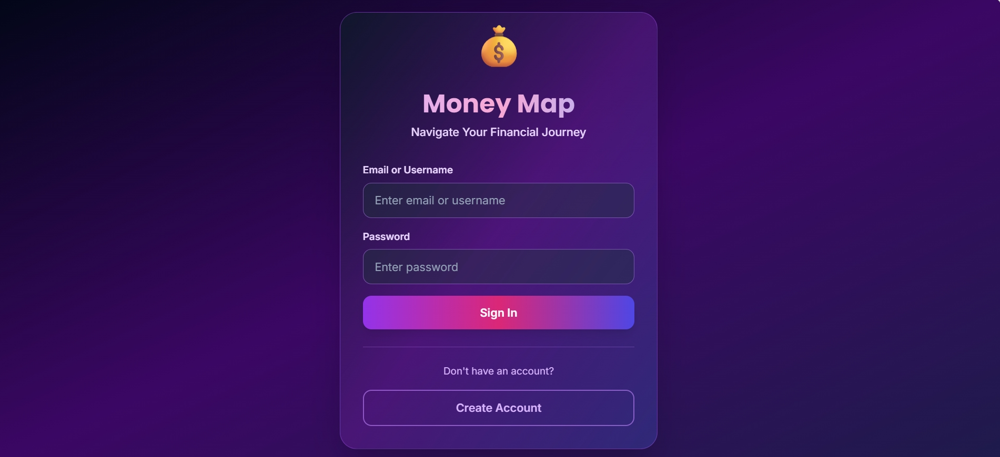
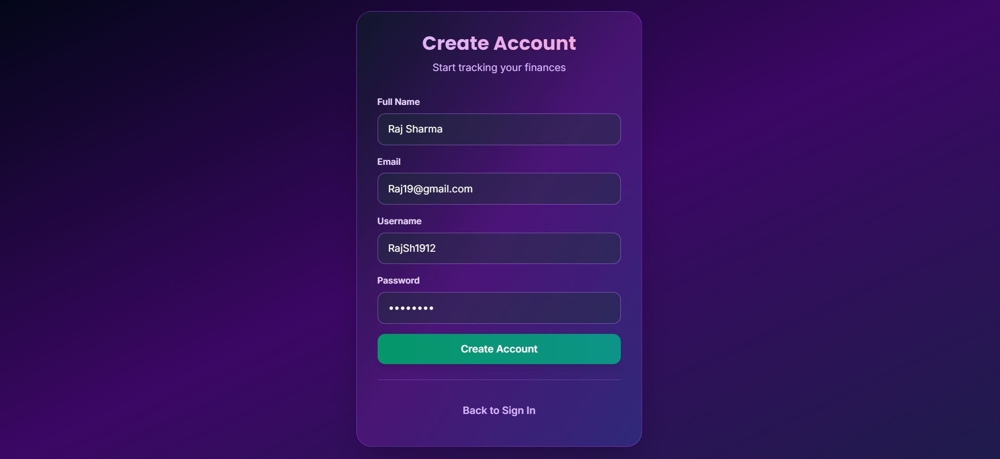
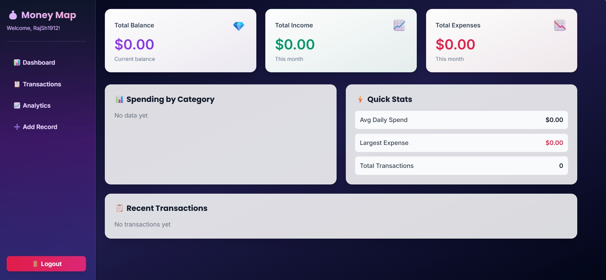
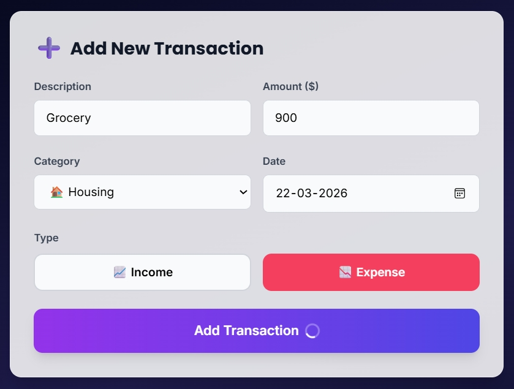
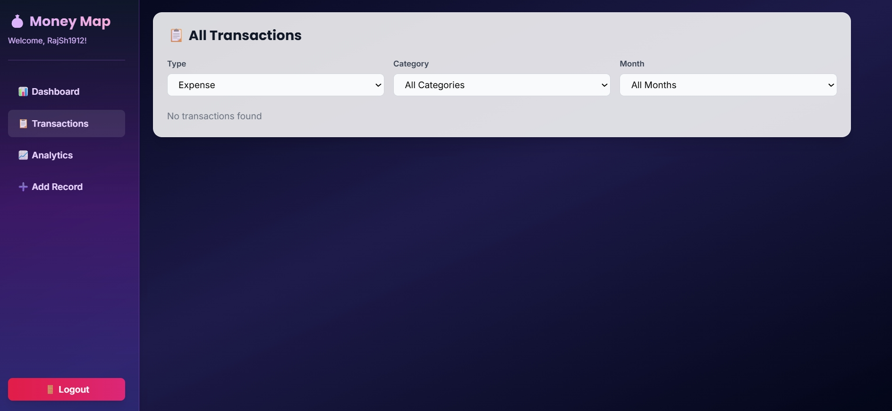

## ✨ Overview
**MoneyMap** is a modern and intuitive web application designed to simplify personal finance management through a clean, visually appealing interface and powerful expense tracking features. Built with a focus on usability and aesthetics, MoneyMap helps users effortlessly monitor their income, expenses, and overall financial health in one centralized dashboard.

At the heart of MoneyMap is its smart expense tracker, which allows users to quickly add, edit, and categorize transactions. Whether it’s daily spending, monthly bills, or occasional purchases, every transaction can be logged with details such as description, amount, date, and category. The app automatically organizes this data, making it easy to understand spending patterns over time.

## 🌟 Features
- ➕ **Smart Expense Tracker** — add, edit, and categorize transactions with essential details.  
- 📊 **Dashboard Overview** — clear summaries of total balance, total income, and total expenses.  
- 📈 **Interactive Charts & Graphs** — visualize spending habits and patterns for better insights.  
- 🎨 **Modern UI Design** — soft color palettes, smooth gradients, rounded cards, and subtle shadows for a calming experience.  
- 🔍 **Filtering & Sorting Options** — view transactions by category, date, or amount.  
- 📱 **Responsive Design** — works seamlessly across desktops, tablets, and smartphones.  
- 🎯 **Beginner-Friendly** — avoids unnecessary complexity, focusing on essential features.  

## 📂 Tech Stack
- **Frontend:** HTML, CSS, JavaScript  
- **Design:** Modern, minimal UI with gradients and charts  
- **Focus:** Personal finance tracking with clarity and simplicity

## Screenshot
### Signin

### Signup

### Dashboard

### Add Transaction

### All Transaction

